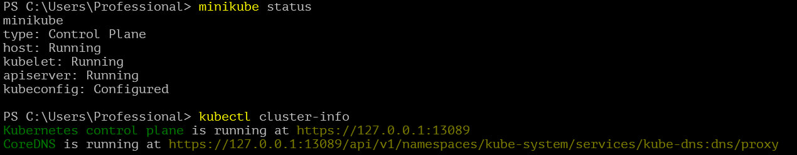

После скачивания всех файлов запускаем Docker Desktop и Minikube.

Проверяем статус кластера:

Применяем конфигурацию объектов Deployment и Service:

Дополнительно проверяем наличие объектов с помощью Dashboard:

Включаем режим проброса портов:

Подключаемся через браузер:

